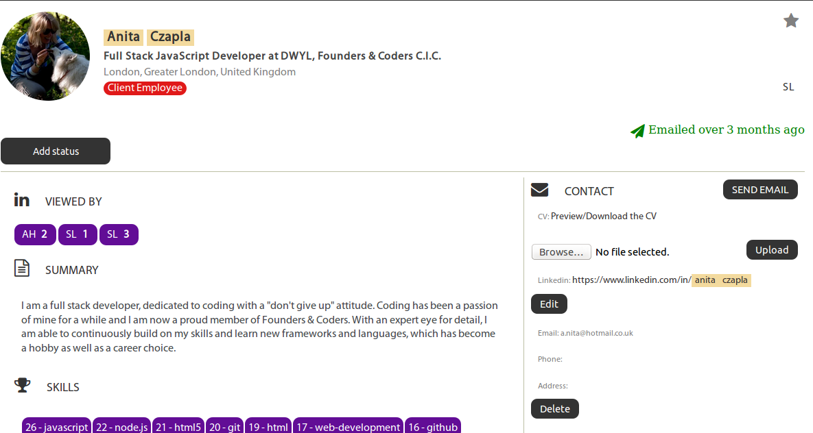
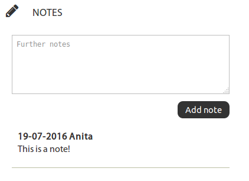
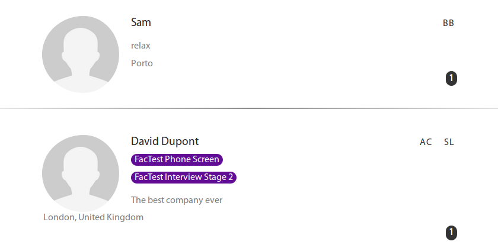
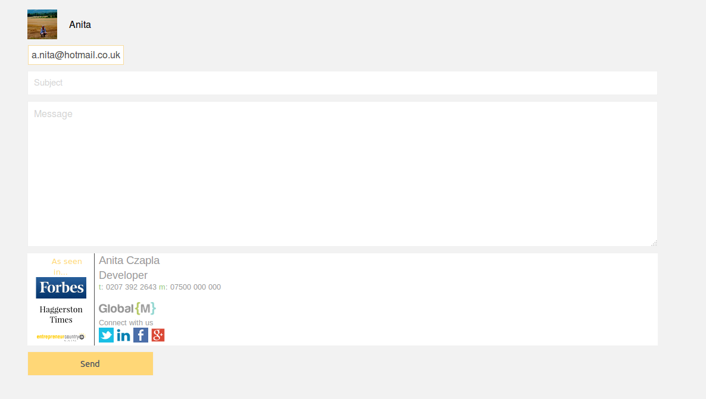

# GM Contact Management

[](https://travis-ci.org/FAC-GM/app)
[](https://codeclimate.com/github/FAC-GM/app)
[](https://david-dm.org/FAC-GM/app)
[](https://codecov.io/github/FAC-GM/app?branch=master)

## What?

This application allows specific members of a team to search through
contacts stored in an ElasticSearch database. Further functionality is [described below](#functionality).

# How?

#### The following technologies are used:

* HTML5, CSS3, Javascript
* [Nodejs](https://nodejs.org/en/)
* [Hapijs](http://hapijs.com/)
  * Main packages: [env2](https://github.com/dwyl/env2), Handlebars, Inert, Vision
  * Testing: Lab, Code
* Databases:
  * [ElasticSearch](https://www.elastic.co/)
  * [Redis](http://redis.io/)

#### Build tools
+ [Travis CI](http://travis-ci.org) runs on every pull request
+ [codecov](https://codecov.io/) runs test coverage on every pull request

#### Database structure
The [database schema can be found here](https://github.com/FAC-GM/app/blob/master/DATA.md) along with an example.

## Running the App *Locally*


Clone the Git repository from GitHub:

```sh
git clone git@github.com:FAC-GM/app.git && cd app
```

### ElasticSearch (*our primary database*)

You will need to have ***ElasticSearch*** running on your local
machine for this to work.  
If you are on Linux/Mac and ***don't want*** to install the Java Runtime
*because* [***Java*** *is* ***insecure***](https://goo.gl/cqEhN4)  
we *recommend* you use [***Vagrant***](https://github.com/dwyl/learn-vagrant)
to run ElasticSearch in a Virtual Machine.  

We have included a `Vagrantfile` with the *bare minimum* you need to
get ElasticSearch up and running. Provided you already have
Vagrant and VirtualBox installed on your machine, you can boot the ES VM
with:

```sh
vagrant up
```


### `.env` file

You will also need to have a `.env` file in the root of your project
with the following environment variables:

```sh
SEARCHBOX_URL #This is changed depending on whether you're running the app with the live database or a local one
PORT
ES_INDEX
ES_TYPE
ES_TYPE_ANALYTICS
RESULTS_PER_PAGE
RESULTS_PER_PAGE_CSV
ES_TYPE_CATEGORIES
JWT_SECRET
JWT_SECRET_CLIENT
BASE_URL
GOOGLE_CLIENT_ID
GOOGLE_CLIENT_SECRET
ES_INDEX_DELETED
ES_TYPE_TOAD=toad
ES_TYPE_COUNTRIES
ES_TYPE_SECTORS
ES_TYPE_CV
CV_ACCESS_TOKEN
CV_ID_TOKEN
CV_REFRESH_TOKEN
CV_EXPIRY_DATE
CV_TOKEN_TYPE
FOLDER_ID
SEARCHBOX_URL_FIXTURES
ES_INDEX_FIXTURES
ES_TYPE_CURRENT_USERS
ES_TYPE_GM_USERS
ES_TYPE_GM_CLIENTS
ES_TYPE_GM_JOBS
ES_TYPE_STATUS
ES_TYPE_GM_CLIENT_USERS
ES_TYPE_CSV_LIST

```

All of the variable values are missing from the example above, but these are available from the dev team.

The MAP_ID_USER environment variable is used to map the id from the user to their first name. We are using the ids to identify users, however, the application shouldn't display the id of the user but the first name and this is where MAP_ID_USER is useful. see the discussion on Github for more details: [issue 215](https://github.com/FAC-GM/app/issues/215) and [issue 238](https://github.com/FAC-GM/app/issues/238)

### Install *node.js* dependencies

```sh
npm install
```

### Run the Unit Tests

```sh
npm test
```

### Boot the App

```sh
npm start
```

Now visit http://localhost:8000 in your browser to view the site.


## Functionality

A running list of the functionality in the app as it becomes available.

+ [Login via Google](https://github.com/dwyl/hapi-auth-github), access restricted to specific team members


+ Initials of who on the team a contact is connected to are displayed
 _(in the example below, David Dupont is connected to our current dev team - Simon L and Anita C)_


* 'Favourite' contact profiles by clicking the grey star in the corner of the profile page


+ Quickly visualise who has been favourited in the search results (denoted by a yellow star) and see a full list by clicking on the yellow star in the top right hand corner of the app


+ Search keywords are highlighted in the search results and profile pages to facilitate quick scanning of the information




+ Symbol in search results to quickly identify if an email address is available for contact


+ Searching query in following fields such as: job, fullname, location, company and skills


You can search for multiple skills if you separate the each skill with a comma:


+ Adding notes to a profile: status, company and note.



+ Status-label display on main page as well as on candidate page


+ Display pie-chart to indicate match-score for search results

- 75% match is shown as below:


+ Display all connection to each user when clicking on initials

- by clicking on initials (top right corner) as shown under:


- list of user connections



+ Dashboard for user's candidate's statuses


+ Home button at the top of each page


+ Sending emails through the application

  - send emails to multiple candidates by clicking on relevant checkboxes
  - send email to candidate from candidate view page

+ Email indicator on home page and candidate detailed view page (this feature replaces the basic email indicator)

  - if an email has been sent within a month, we display red 'sent icon' with text: Emailed within a month

  

  - if an email has been sent within 3 months time, we display amber'sent icon' with text: Emailed in less than 3 months

  

  - if email has been sent more than 3 months ago: we display green 'sent icon' with text: Emailed over 3 months ago

  

+ Personal signatures match to all the users are included in the email

  

+ Dynamically populating candidates first names and text ```Hi {name}``` when sending an email in a message area

+ Blacklist feature

  - if the candidate is the client employee, we display following indicator:

  

  - disabled email checkbox for client employee and candidate with status prevents accidently sending email

+ Merging candidates coming from the website

  - following image on teh home page indicates the new candidate coming from the website

  

  - jobs applied by the relevant candidate

  


## Working with this repo
Our [product backlog is our list of issues](https://github.com/FAC-GM/app/issues).

We use labels to manage these. The most interesting ones are:
+ `feature idea` - added to features that are just in idea form for now rather than _definitely_ required
+ `priority...` - labels starting with 'priority' denote the priority of the task from 1 to 5, with 1 being the highest
+ `T...` - labels starting with 'T' denote time estimates for the task; these are added **by the dev team only**, e.g. `T1d` will require one day to complete
  + `m` = minutes
  + `h` = hours
  + `d` = days
+ `in progress` - denotes which tasks are currently being worked on
+ `help wanted` - used mostly internally by the dev team when outside help is required to move an issue forward
+ `technical` - used **by the dev team** to denote technical tasks

## Google Analytics

Google Analytics is enabled for all pages of the App.
If you want access to the stats, please ask a member of the dev team.
